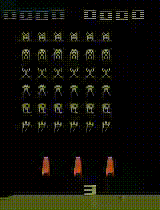

# Atari Deep Q Network

[Reinforcement Learning] pytorch implementation of Deep Q Network (DQN) on Atari Space-Invaders Game



## Installation

- Clone this repo
```
git clone https://github.com/UgoPelissier/AtariDeepQNetwork.git
```

- Install dependencies
```
conda env create -f environment.yml
conda activate atari_dqn
```

If you encounter ```InvalidArchiveError```, use ```conda clean --all``` and run again the installation of the environment.

## Running

### Training
Run
```
bash ./scripts/train.sh
```

To view the reward plot, in another terminal run  ```tensorboard --logdir ./src/logs``` and click http://localhost:6006.

You can stop the program (ctrl+C) whenever you are satisfied with the reward obtained. The result is  ```./model/model.pack```.

### Observe the agent playing
Run
```
bash ./scripts/test.sh
```

You can also skip the training part and run
```
bash ./scripts/trained.sh
```
This will use a model already trained (```./model/trained/model.pack```).

In any case, this will create a video of the agent playing the game in the ``videos/`` folder.

## Files descripition

### Source

```src``` folder contains the python code.

The main file is ```train.py```, which runs the training, using the python files in ```utils```.

- ```network.py``` - Contains the CNN proposed in Deepmind article to train the agent, and the associated act and loss functions.
- ```parameters.py``` - Enables the user to specify parameters in the scripts
- ```msgpack_numpy.py``` - Contains model saving functions

### Scripts

```scripts``` folder contains the bash scripts to run the training and testing. For training, various parameters can be passed as arguments.